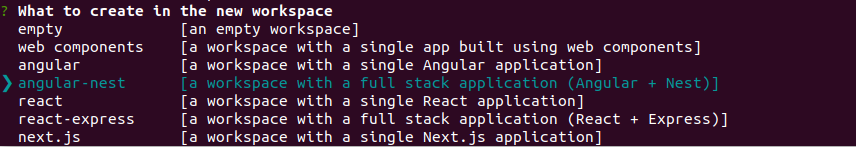

# Angular Nestjs Jwt

Template for setting up an Angular application using Nestjs and JWT.

## Installation

```bash
$ git clone https://github.com/kgish/angular-nestjs-jwt.git
$ cd angular-nestjs-jwt
```

## Original setup

For those interested, here is a short guide to how this workspace was originally setup.

### Dependencies

Install the latest releases of the Angular CLI, Nrwl/Nx CLI and Schematics.

```bash
$ yarn global add @angular/cli @nrwl/cli @nrwl/schematics
```

When asked select angular-nest.



### Workspace

Create the workspace and change directories.

```bash
$ yarn create nx-workspace ng-nest-jwt --directory=angular-nestjs-jwt
$ cd angular-nestjs-jwt
```

### Docker

Create a docker-compose.yml file in the root directory with the following contents.

```yaml
version: '2.4'
services:
  db:
    container_name: angular_nestjs_db
    image: postgres:10.7
    volumes:
      - './db/initdb.d:/docker-entrypoint-initdb.d'
    ports:
      - '5432:5432'
```
Add the following to package.json:

```
{
  ...
  "scripts": {
    ...
    "run:services": "docker-compose up && exit 0",
    "stop:services": "docker-compose down"
  },
  ...
}
```

### Dotenv

```bash
$ yarn add dotenv @types/dotenv
```

In the workspace root directory add a file `.env` with the following contents.

```.env
DB_type=postgres
DB_host=localhost
DB_PORT=5432
DB_USER=angular_nestjs
DB_PASSWORD=angular_nestjs
DB_DATABASE=angular_nestjs
DB_SYNCHRONIZE=true
DB_LOGGING=true
```

### TypeOrm

From the workspace root directory, install the typeorm library.

```bash
$ yarn add typeorm pg @nestjs/typeorm
```

Create a configuration file in the workspace root directory called `ormconfig.json` with the following contents.
```json
{
  "name": "development",
  "type": "postgres",
  "host": "localhost",
  "port": 5432,
  "username": "angular_nestjs",
  "password": "angular_nestjs",
  "database": "angular_nestjs",
  "synchronize": true,
  "logging": true,
  "entities": ["dist/api/**/*.entity.js"],
  "cli": {
    "entitiesDir": "apps/api/app/src"
  }
}
```
### Package.json

```
"watch:server": "nodemon",
"build:server": "tsc -p ./apps/api/tsconfig.app.json",
"run:server": "node -r dotenv/config -r source-map-support/register dist/apps/api/src/main.js"
```

## References

* [Angular](https://angular.io)
* [Nestjs](https://nestjs.com)
* [Nx dev](https://nx.dev)
* [Docker](https://www.docker.com)
* [Postgres](https://www.postgresql.org)
* [TypeOrm](https://typeorm.io)
* [TypeScript](https://www.typescriptlang.org)
* [Angular and the REST with Nest.js](https://dev.to/thisdotmedia/angular-and-the-rest-with-nest-js-2glo)
